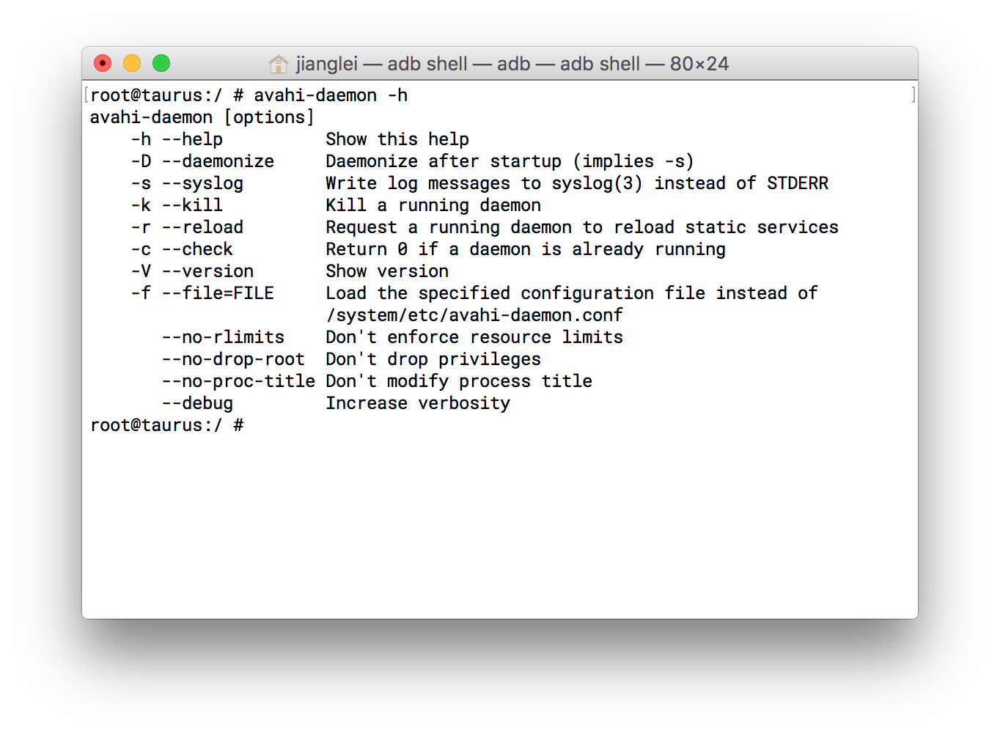
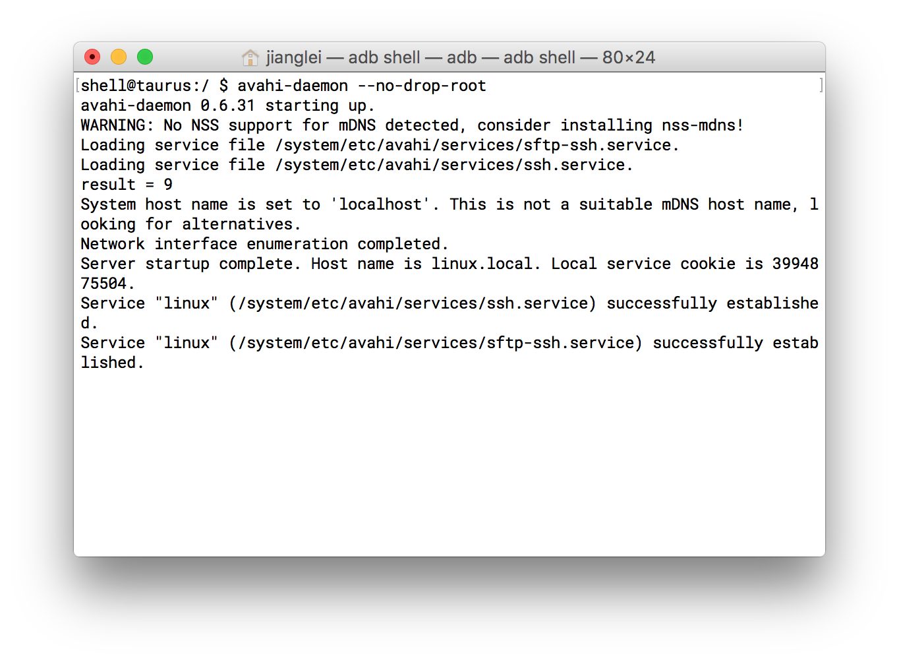
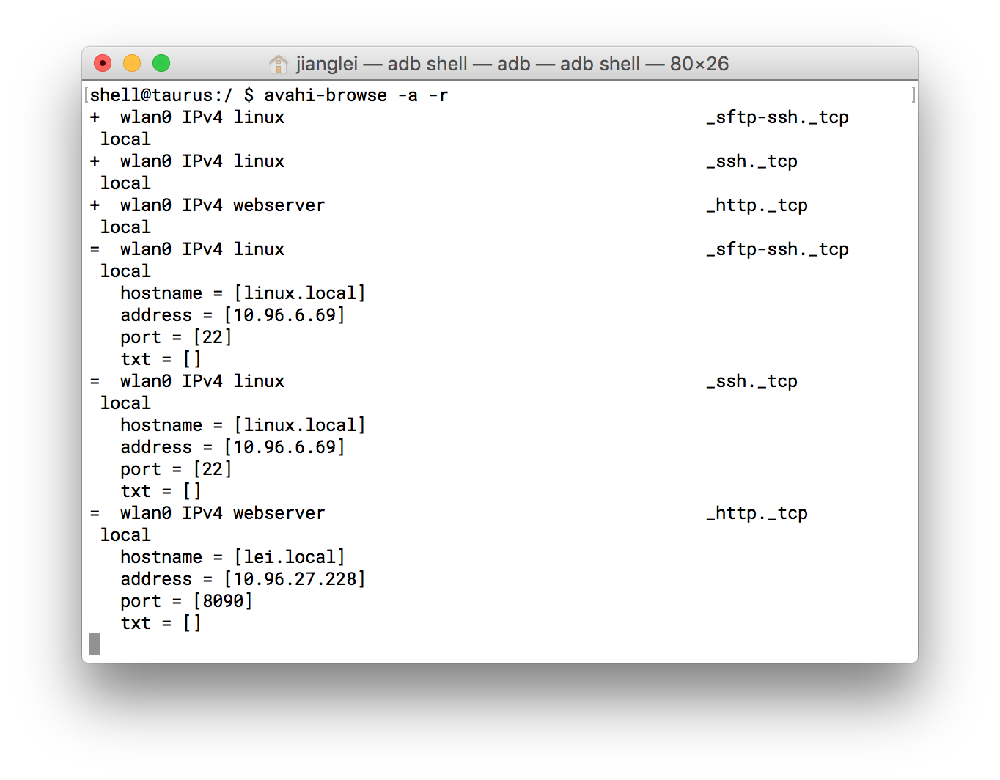

#avahi

Avahi 是Zeroconf规范的开源实现，常见使用在Linux上。它可以在没有 DNS 服务的局域网里发现基于 zeroconf 协议的设备和服务。本项目是安卓平台的移植，使用时需要把etc目录下的配置文件放到安卓/system/etc目录下。

使用时avahi-daemon时，带上--no-drop-root否则可能会导致socket()打开失败。例子:

- 打开dbus

  dbus-daemon --system --print-address

- 打开avahi daemon

  

- 查看设备
  